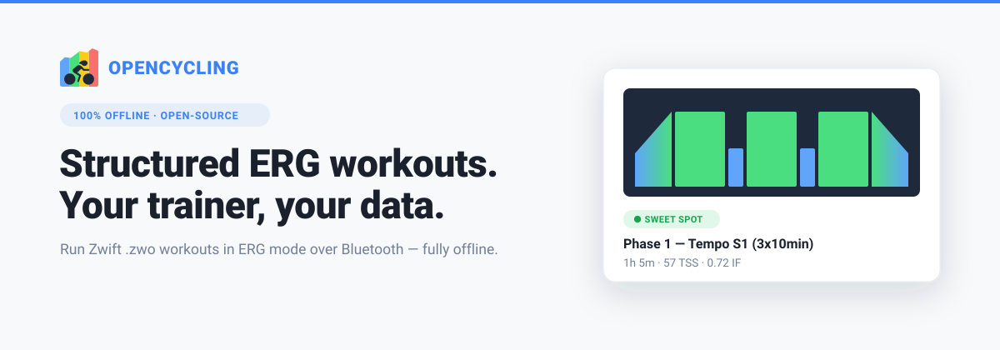
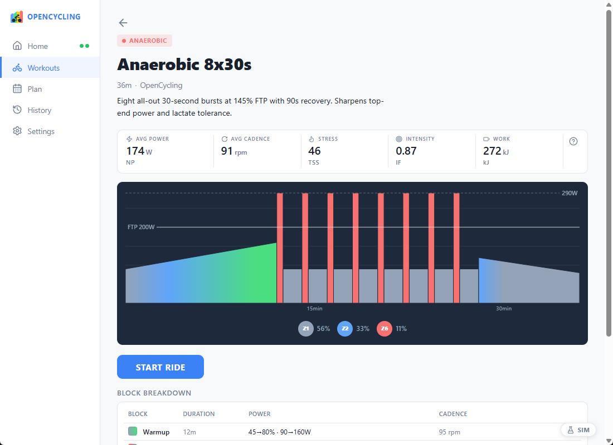
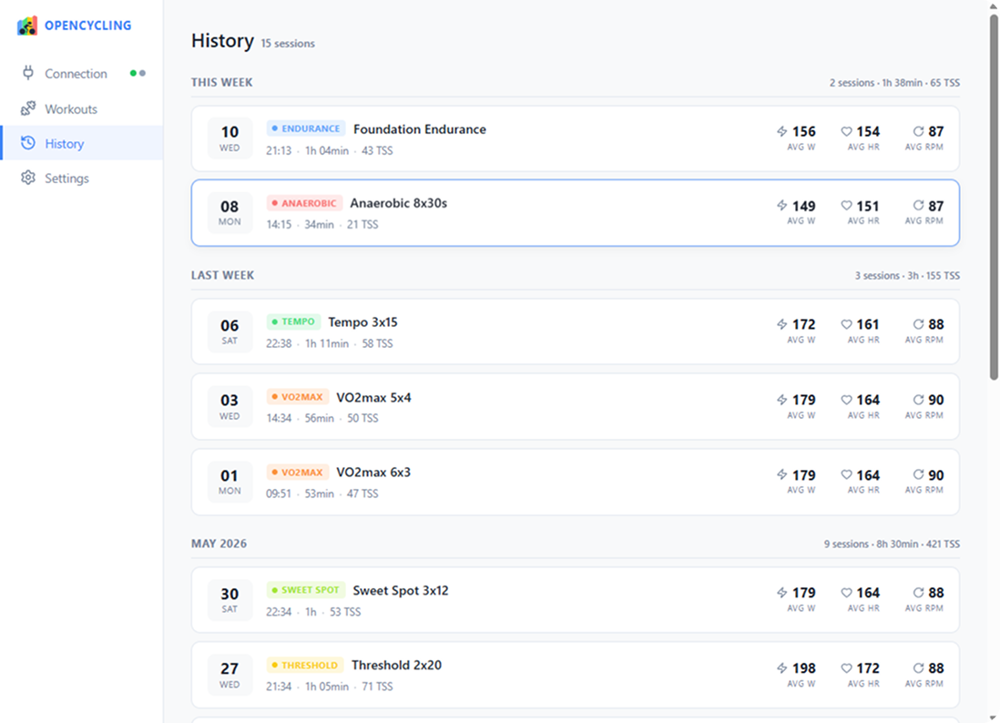

<h1 align="center">OpenCycling</h1>
<!-- Screenshot: app overview / hero shot -->
<p align="center">
  
</p>
A lightweight, open-source desktop application for **structured indoor cycling workouts in ERG mode**. OpenCycling connects to a smart trainer over Bluetooth, runs `.zwo` workouts by setting the target power automatically, and lets you review each session afterwards. Everything runs offline, with no account and no subscription.

OpenCycling is an open alternative to commercial indoor training applications for cyclists who just want to run a structured ERG session and own their data.

---

# 🚴 For Users

## 🔌 Compatibility

OpenCycling speaks the standard BLE **FTMS** (trainers) and **HRS** (heart rate) protocols, so it should work with any compliant device. In practice, only the hardware below has been verified.

| Device | Type | Protocol | Status |
|---|---|---|---|
| Decathlon D500 | Smart trainer | FTMS (0x2AD2) | ✅ Tested, reference device |
| Polar (H9 / H10 / OH1...) | Heart rate monitor | HRS (0x2A37) | ✅ Tested |
| Other FTMS trainers | Smart trainer | FTMS (0x2AD2) | ⚪ Should work, untested |
| Other HRS straps | Heart rate monitor | HRS (0x2A37) | ⚪ Should work, untested |

> **ERG mode only.** OpenCycling drives the trainer's target power and runs structured `.zwo` workouts. There is no free-ride / SIM (slope) mode and no manual resistance control. A trainer that does not support FTMS Set Target Power cannot be used. A heart rate monitor is optional.

**Platform:** the primary development and testing target is **Windows**. On Windows WinRT, BLE filtering by service UUID is unreliable, so devices are filtered by name prefix (`"D500"` for the trainer, `"Polar"` for the HRM). Non-Polar straps or non-D500 trainers may need the prefix filters adjusted in the code.

## ✨ Features

### BLE scanning & connection

- **Automatic BLE scanning.** Connects the trainer (required) and an optional heart-rate monitor, with separate status for each.

### Session

- **Structured `.zwo` workouts.** Reads workouts from a folder you choose; target watts come from each block's `%FTP` and your FTP.
- **FTP ramp test.** A built-in ramp test (power rises every minute in ERG) that watches for exhaustion: when you can no longer hold the target it counts down and prompts you to stop, then estimates your new FTP as 75% of your best 1-minute power and lets you apply it in one click.
- **ERG control per block.** Drives the trainer's target power every second, with linear ramps for warmups and cooldowns and a keep-alive so resistance never drops.
- **Pedal-to-start.** No countdown; the session begins automatically as soon as you start pedalling.
- **Live session view.** Current block and target, power, heart rate, cadence, elapsed and remaining time, and a block-by-block timeline.
- **Audio cues.** Beeps at start, end, each block transition, and counting down a block's final seconds.
- **Pause, resume, and skip block** during a session.
- **Automatic recording.** Power, heart rate, and cadence sampled every second to a local SQLite database, so a session survives an early stop.
- **Session summary and history.** Browse past sessions as cards and open any one for stats, a power graph, and six-zone power and heart-rate breakdowns based on your FTP and max HR.

### Optional settings & third-party integrations

- **Aero position detection (optional, webcam).** After a short calibration, a live indicator on the session screen shows whether you are aero or upright, and your overall time in aero is saved with the session and shown in history. Fully offline and off unless you enable it.
- **TCX export.** Export any session to a standard `.tcx` (per-second power, HR, and cadence plus a workout-structure note) for Strava, Garmin Connect, or any TCX tool.
- **Strava upload (optional, manual setup).** Push a finished session straight to Strava as a Virtual Ride. There is no shared account: to keep the app fully open you bring your own Strava app (Strava Premium required) and run a small [auth proxy](https://github.com/TheElysium/opencycling-strava-proxy) (about two minutes, see its [setup guide](https://github.com/TheElysium/opencycling-strava-proxy/blob/main/README.md)).

## 📸 Screenshots

<!-- Replace each placeholder below with a real capture in docs/screenshots/ -->

### Connection
<!-- Screenshot: device connection page -->


### Workout library and detail

<!-- Screenshot: workouts list + a workout detail with the block chart -->
<table>
  <tr>
    <td></td>
    <td></td>
  </tr>
</table>

### Live session

<!-- Screenshot: active session view with tiles + timeline -->


### Session summary / history

<!-- Screenshot: a past session detail with power graph + zone bars -->
<table>
  <tr>
    <td></td>
    <td></td>
  </tr>
</table>

### Settings

<!-- Screenshot: settings page (workout folder, FTP, max HR) -->


## 🚀 Getting Started

1. Install the app, or build it from source (see the contributor section below).
2. Open **Settings** and set your `.zwo` folder path, your **FTP** (watts), and your **max heart rate** (bpm).
3. Power on your trainer. Scanning starts automatically on the connection page; connect the trainer (and your HRM if you use one).
4. Pick a workout, start it, and begin pedalling to launch the session.

## 🐛 Reporting a Bug or Requesting a Feature

Please use the GitHub issue tracker: **[github.com/TheElysium/opencycling/issues](https://github.com/TheElysium/opencycling/issues)**.

- For a **bug**, open a new issue and include your OS, your trainer and HRM models, the steps to reproduce, and what you expected vs. what actually happened. Attaching the log file from the app's log directory helps a lot.
- For a **feature request**, open an issue describing the use case and why it would help.

Please search existing issues first to avoid duplicates.

---

# 🛠️ For Contributors

## 🧱 Tech Stack

- **Framework:** [Tauri v2](https://tauri.app/) (desktop shell)
- **Frontend:** [SvelteKit 5](https://svelte.dev/) (Svelte runes), TypeScript, Vite; [TensorFlow.js](https://www.tensorflow.org/js) + MoveNet (bundled offline) for webcam aero detection
- **Backend:** Rust (edition 2021), Tokio, `rusqlite`, `roxmltree`, `thiserror`, `tracing`
- **Storage:** SQLite (schema-migrated on startup)

## 🏗️ Architecture

The Rust backend separates **pure parsers** (no I/O, fully unit-tested) from **Tokio actors** that own all state and communicate over `mpsc` channels:

| Module | Responsibility |
|---|---|
| `ble/ftms` | Parses FTMS Indoor Bike Data (0x2AD2) and builds the Set Target Power command |
| `ble/hrs` | Parses HRS Heart Rate Measurement (0x2A37), 8- and 16-bit formats |
| `workout/zwo` | Parses `.zwo` XML into an ordered list of `WorkoutBlock` |
| `BleActor` | BLE scan/connect, ERG keep-alive, emits `ble_metrics` |
| `SessionActor` | Session state machine (`WaitingForRider` → `Running` ⇄ `Paused` → `Finished`), per-second tick, target-power output, emits `session_metrics` |
| `DbActor` | Wraps SQLite for sessions, per-second samples, and settings |

The frontend calls Rust via `invoke('<command>', args)`, and Rust pushes live data back through Tauri events (`ble_metrics`, `session_metrics`, `ble_error`).

Aero detection follows the same split, on the frontend side: pose scoring is done entirely in the webview (`lib/aero.ts` pure functions, unit-tested; `lib/aero.svelte.ts` rune store owning the camera and MoveNet detector). The frontend makes the smoothed, debounced aero/upright decision and reports it over the `report_aero` bridge once per second; Rust stays "dumb" and just stores the value into each 1 Hz sample and averages it into the session's `aero_pct`.

> Note: `docs/prd.md` is an early design document and has drifted from the implementation (for example, it describes a countdown and synthesized ramps that the code does not use). Treat the code as the source of truth.

## 📦 Prerequisites

- [Node.js](https://nodejs.org/) and [pnpm](https://pnpm.io/)
- [Rust](https://www.rust-lang.org/tools/install) (stable toolchain)
- [Tauri v2 system dependencies](https://tauri.app/start/prerequisites/) for your OS

## ⚙️ Build & Run

Frontend and full app (from the repo root):

```bash
pnpm install
pnpm tauri dev      # run the full Tauri app (frontend + Rust backend)
pnpm check          # TypeScript / Svelte type checking
```

Rust backend (from `src-tauri/`):

```bash
cargo test                  # run all unit tests
cargo test <test_name>      # run a single test by partial name match
cargo clippy                # lint
```

## 🧪 Testing Conventions

Tests live in the same file as the code they test, inside a `#[cfg(test)]` module (no separate test files). Pure parsers and the session state machine are unit-tested. The actors are not unit-tested: `BleActor` depends on BLE hardware, `DbActor` on SQLite I/O, and `SessionActor` on the Tokio runtime. They are validated manually or via integration tests.

## 📄 License

OpenCycling is licensed under the **GNU General Public License v3.0 or later**. See [LICENSE](LICENSE) for the full text.

This is a copyleft license: any redistributed version, including modified forks, must also be released as open source under the GPL.

Copyright (C) 2026 Luka Signe--Morice
