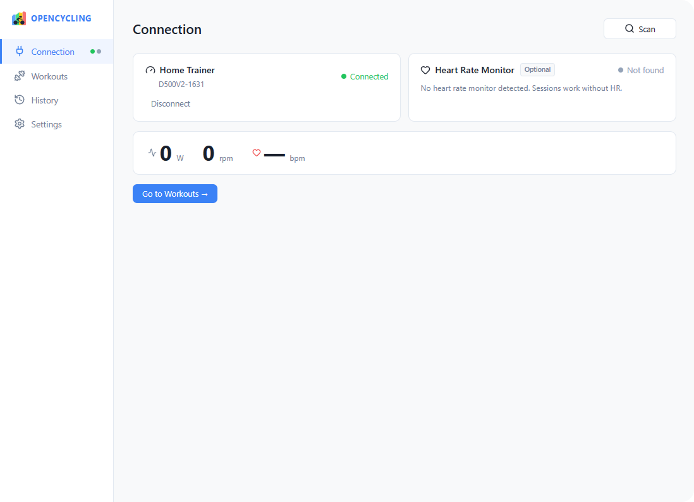
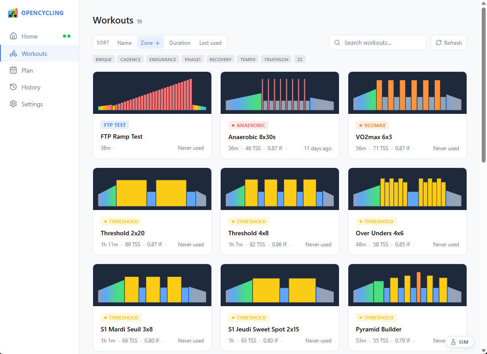
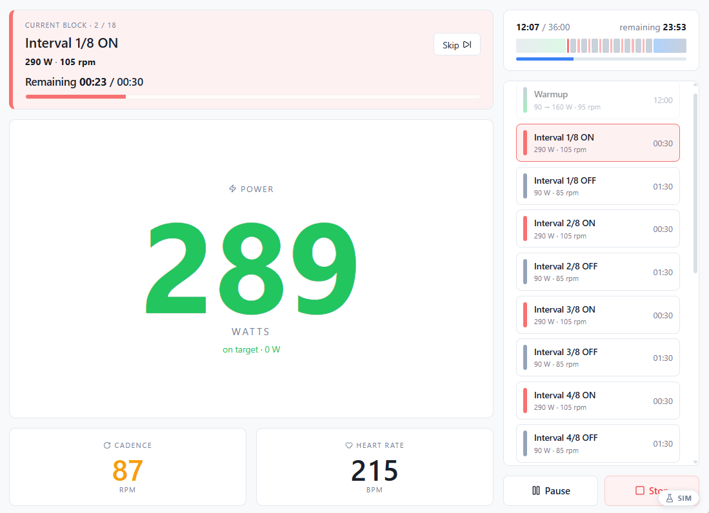
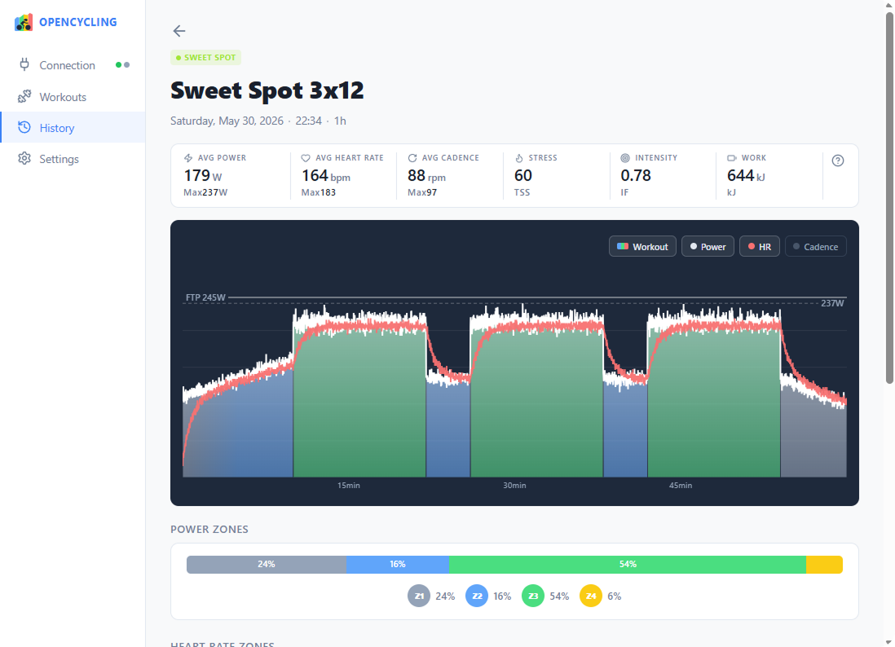
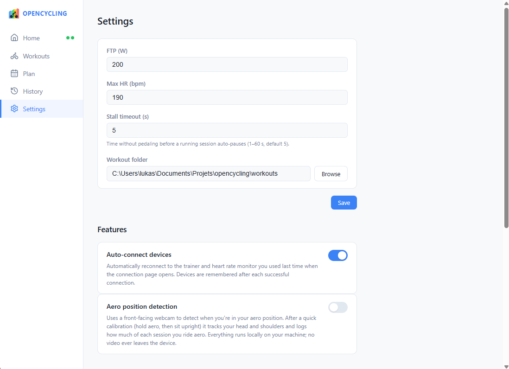

<p align="center">
  
</p>

<h1 align="center">OpenCycling</h1>

A lightweight, open-source desktop application for **structured indoor cycling workouts in ERG mode**. OpenCycling connects to a smart trainer over Bluetooth, runs Zwift `.zwo` workouts by setting the target power automatically, and lets you review each session afterwards. Everything runs offline, with no account and no subscription.

OpenCycling is an open alternative to Indoor training applications (Zwift, TrainerRoad, ...) for cyclists who just want to run a structured ERG session and own their data.

<!-- Screenshot: app overview / hero shot -->
<p align="center">
  
</p>

---

# For Users

## Compatibility

OpenCycling speaks the standard BLE **FTMS** (trainers) and **HRS** (heart rate) protocols, so it should work with any compliant device. In practice, only the hardware below has been verified.

| Device | Type | Protocol | Status |
|---|---|---|---|
| Decathlon D500 | Smart trainer | FTMS (0x2AD2) | Tested, reference device |
| Polar (H9 / H10 / OH1...) | Heart rate monitor | HRS (0x2A37) | Tested |
| Other FTMS trainers | Smart trainer | FTMS (0x2AD2) | Should work, untested |
| Other HRS straps | Heart rate monitor | HRS (0x2A37) | Should work, untested |

> **ERG mode only.** OpenCycling drives the trainer's target power and runs structured `.zwo` workouts. There is no free-ride / SIM (slope) mode and no manual resistance control. A trainer that does not support FTMS Set Target Power cannot be used. A heart rate monitor is optional.

**Platform:** the primary development and testing target is **Windows**. On Windows WinRT, BLE filtering by service UUID is unreliable, so devices are filtered by name prefix (`"D500"` for the trainer, `"Polar"` for the HRM). Non-Polar straps or non-D500 trainers may need the prefix filters adjusted in the code.

## Features

- **Automatic BLE scanning** on launch, with separate connection status for the trainer and the HRM. The trainer must be connected to start a session; the HRM is optional.
- **Zwift workout support.** Reads `.zwo` files from a folder you configure. Supported blocks: `Warmup`, `SteadyState`, `IntervalsT`, and `Cooldown` (`FreeRide` blocks are skipped). Target watts are computed from each block's `%FTP` and your configured FTP.
- **ERG control per block.** During a session the app sends the block's target power to the trainer every second. Steady blocks hold a constant target; warmup, cooldown, and ramp blocks follow a linear power progression from start to end watts. An ERG keep-alive resends the current target periodically so the trainer never drops resistance.
- **Pedal-to-start.** No countdown: a session waits for the rider and begins automatically as soon as you start pedalling.
- **Live session view.** Current block and its target, actual power, heart rate, cadence, elapsed and remaining time, a block-by-block timeline, and the full workout block list.
- **Audio cues.** A low beep at start and at the end of the session, a long beep at each block transition, and short beeps counting down the final seconds of a block.
- **Pause, resume, and skip block** during a session.
- **Automatic recording.** Power, heart rate, and cadence are sampled every second and stored in a local SQLite database, so a session is kept even if it ends early.
- **Session summary and history.** Browse past sessions as cards (date, duration, averages, intensity badge) and open any one for a detail view with summary stats, a power-over-time graph, the workout blocks, and zone breakdowns. Power uses six zones (Recovery, Endurance, Tempo, Threshold, VO2max, Anaerobic) based on your FTP; heart rate zones use your configured max HR.

## Screenshots

<!-- Replace each placeholder below with a real capture in docs/screenshots/ -->

**Connection**

<!-- Screenshot: device connection page -->


**Workout library and detail**

<!-- Screenshot: workouts list + a workout detail with the block chart -->


**Live session**

<!-- Screenshot: active session view with tiles + timeline -->


**Session summary / history**

<!-- Screenshot: a past session detail with power graph + zone bars -->


**Settings**

<!-- Screenshot: settings page (workout folder, FTP, max HR) -->


## Getting Started

1. Install the app, or build it from source (see the contributor section below).
2. Open **Settings** and set your `.zwo` folder path, your **FTP** (watts), and your **max heart rate** (bpm).
3. Power on your trainer. Scanning starts automatically on the connection page; connect the trainer (and your HRM if you use one).
4. Pick a workout, start it, and begin pedalling to launch the session.

## Reporting a Bug or Requesting a Feature

Please use the GitHub issue tracker: **[github.com/TheElysium/opencycling/issues](https://github.com/TheElysium/opencycling/issues)**.

- For a **bug**, open a new issue and include your OS, your trainer and HRM models, the steps to reproduce, and what you expected vs. what actually happened. Attaching the log file from the app's log directory helps a lot.
- For a **feature request**, open an issue describing the use case and why it would help.

Please search existing issues first to avoid duplicates.

---

# For Contributors

## Tech Stack

- **Framework:** [Tauri v2](https://tauri.app/) (desktop shell)
- **Frontend:** [SvelteKit 5](https://svelte.dev/) (Svelte runes), TypeScript, Vite
- **Backend:** Rust (edition 2021), Tokio, `rusqlite`, `roxmltree`, `thiserror`, `tracing`
- **Storage:** SQLite (schema-migrated on startup)

## Architecture

The Rust backend separates **pure parsers** (no I/O, fully unit-tested) from **Tokio actors** that own all state and communicate over `mpsc` channels:

| Module | Responsibility |
|---|---|
| `ble/ftms` | Parses FTMS Indoor Bike Data (0x2AD2) and builds the Set Target Power command |
| `ble/hrs` | Parses HRS Heart Rate Measurement (0x2A37), 8- and 16-bit formats |
| `workout/zwo` | Parses `.zwo` XML into an ordered list of `WorkoutBlock` |
| `BleActor` | BLE scan/connect, ERG keep-alive, emits `ble_metrics` |
| `SessionActor` | Session state machine (`WaitingForRider` → `Running` ⇄ `Paused` → `Finished`), per-second tick, target-power output, emits `session_metrics` |
| `DbActor` | Wraps SQLite for sessions, per-second samples, and settings |

The frontend calls Rust via `invoke('<command>', args)`, and Rust pushes live data back through Tauri events (`ble_metrics`, `session_metrics`, `ble_error`).

> Note: `docs/prd.md` is an early design document and has drifted from the implementation (for example, it describes a countdown and synthesized ramps that the code does not use). Treat the code as the source of truth.

## Prerequisites

- [Node.js](https://nodejs.org/) and [pnpm](https://pnpm.io/)
- [Rust](https://www.rust-lang.org/tools/install) (stable toolchain)
- [Tauri v2 system dependencies](https://tauri.app/start/prerequisites/) for your OS

## Build & Run

Frontend and full app (from the repo root):

```bash
pnpm install
pnpm tauri dev      # run the full Tauri app (frontend + Rust backend)
pnpm check          # TypeScript / Svelte type checking
```

Rust backend (from `src-tauri/`):

```bash
cargo test                  # run all unit tests
cargo test <test_name>      # run a single test by partial name match
cargo clippy                # lint
```

## Testing Conventions

Tests live in the same file as the code they test, inside a `#[cfg(test)]` module (no separate test files). Pure parsers and the session state machine are unit-tested. The actors are not unit-tested: `BleActor` depends on BLE hardware, `DbActor` on SQLite I/O, and `SessionActor` on the Tokio runtime. They are validated manually or via integration tests.

## License

OpenCycling is licensed under the **GNU General Public License v3.0 or later**. See [LICENSE](LICENSE) for the full text.

This is a copyleft license: any redistributed version, including modified forks, must also be released as open source under the GPL.

Copyright (C) 2026 Luka Signe--Morice
